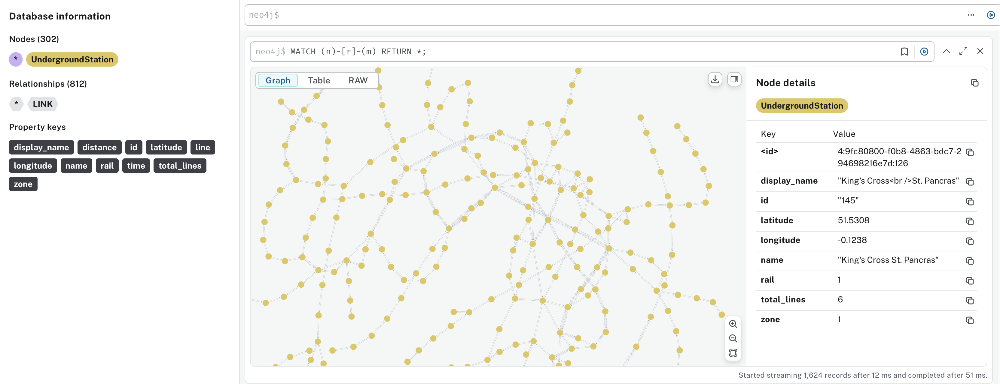

# gds-agents

Neither LLMs nor any existing toolings (MCP Servers) are capable of complex reasoning on graphs at the moment.
By reasoning on graphs, we mean the ability to decide and accurate execute the appropriate parameterised graph algorithms over large heterogeneous attributed graphs.

This MCP Server includes toolings from Neo4j Graph Data Science (GDS) library, which allows you to run all common graph algorithms.

Once the server is running, you are able to **ask any graph questions about your Neo4j graph** and get answers.


# Setup
1. Install necessary packages in your python environment with `pip install -r requirements.txt`
2. Install the Neo4j database with GDS plugin:
   Download the Neo4j Desktop from [Neo4j Download Center](https://neo4j.com/download/)
   Install the GDS plugin from the Neo4j Desktop
   Create a new database and start it
3. Populate .env file with necessary credentials:
   ```bash
   NEO4J_URI=bolt://localhost:7687  # or other database URL if running in Aura
   NEO4J_USERNAME=neo4j  # or other customer name
   NEO4J_PASSWORD=your_password
   ```
4. Load the London Underground dataset with the following command:
   ```bash
   python import_data.py
   ```
Connect to your DB and querying the graph from [Neo4j workspace](https://workspace-preview.neo4j.io/workspace/), 
you should see:



# Start the server
Run `uv sync` and run `claude` from command line when inside the `mcp_server`.